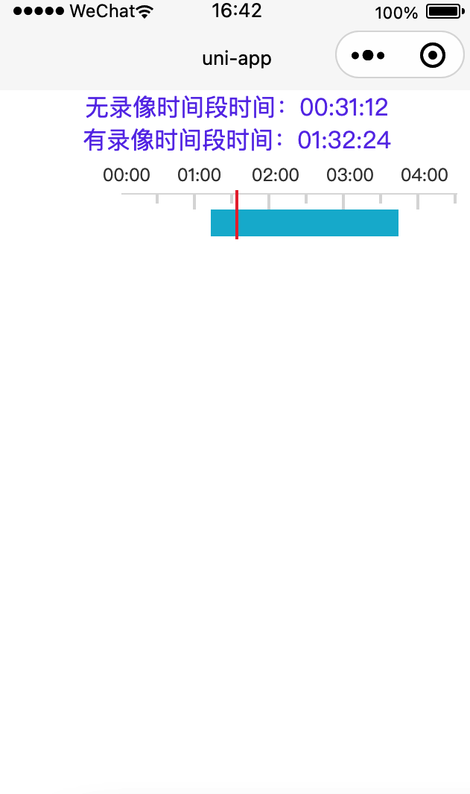
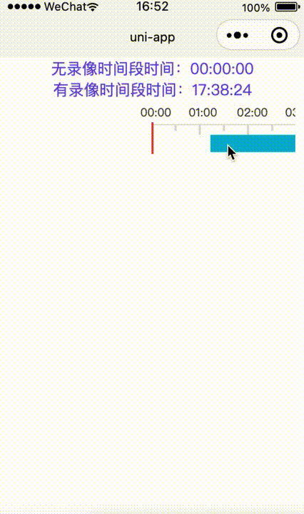

# video-time-slider

用于IVR视频回播的时间选择插件，刻度尺的实现参考了[vue语法css实现刻度尺](https://ext.dcloud.net.cn/plugin?id=4567)，为项目微信小程序制作。基于`uni-app`开发。

其实这个可以做成前端通用组件的，因为本人项目只在微信小程序使用此插件，就先做成小程序版本了，其它平台没试过，但是估计都能用。

和 [live-player](https://uniapp.dcloud.io/component/live-player) 配合使用，播放视频挺流畅的。

## 功能

* 24小时刻度尺，30分钟分隔
* 有录像的时间段在刻度尺上标识（支持多个时间段）
* 回传刻度无录像时间段时间值、刻度有录像时间段时间值（用于接口获取播放视频）
*  目前刻度尺返回值精确到秒
* 自动回滚最后有录像时间段

## 效果图






## 有录像的时间段在刻度尺上标识（支持多个时间段）实现思路

*（纯粹记录下，怕自己忘记了，肯定会忘记的）*

传参是以时间段的方式，每段录像的开始时间、结束时间为一组。以开始时间、结束时间在刻度尺上的位置，渲染一段带颜色的`view`，就能实现多个时间段在刻度尺上的标识。

### 代码实现思路

处理渲染用的开始时间、结束时间数组，形成新的时间段，每个时间段由以下3个元素组成：

####  1、开始时间位置距（0点）距离，这里代号a

以0点为原点，找到开始时间在刻度尺上的位置，算法在`utils.js`文件的`dateToGrid`方法里。难点主要是24小时刻度尺上`px`长度和真实时间之间的转换。

`t1`算出开始时间的位置在刻度尺上占多少`px`格子，然后乘每个格子的宽度，就得到开始时间位置距原点距离`poi`

```
let poi = t1 * this.single
```

####  2、时间段在刻度尺上的长度，这里代号b

`t2`算出结束时间的位置在刻度尺上占多少`px`格子，`t2`减`t1`就是时间段在刻度尺上的长度`len`了。

```
let len = (t2-t1).toFixed(2) * this.single
```

####  3、结束时间距（0点）的距离，这里代号c

这个有2种算法：

* 1、开始时间位置`poi`加时间段长度`len`

```
let left = poi + len
```

* 2、计算结束时间位置距开始时间（0点）距离

```
let left = t2 * this.single
```

### 页面渲染


```
<view class="scale-active">
    <view class='scale-active-time' v-for="(it, idt) in newActiveTime" :key="idt" :style="{marginLeft: idt>0?newActiveTime[idt][0]-newActiveTime[idt-1][2] + 'px':newActiveTime[idt][0] + 'px'}">
        <view class="scale-active-item" :style="{width: it[1] + 'px'}" />
    </view>
</view>
```

#### scale-active-time

主要是定位时间段开始渲染的位置。

* newActiveTime[idt][0] + 'px'

第一个时间段开始渲染的位置就是`a`

* newActiveTime[idt][0]-newActiveTime[idt-1][2] + 'px'

`>0`的时间段，用下一个时间段的开始时间位置`a`减去上一个时间段结束时间位置`c`，就可以得到下一个时间段开始渲染的位置


#### scale-active-item

每个时间段`view`的宽度`width`


以上，就是时间刻度尺上标识带录像时间段的思路了。

## 使用

### 页面引入

```
import videoTimeSlider from '@/uni_modules/video-time-slider/components/video-time-slider/video-time-slider.vue'
```

### 页面调用

```
<video-time-slider :curDate="2021-11-29"
    :activeTime="[['01:12', '03:43'],['05:22', '07:33'],['12:02', '17:39']]" 
    @value="curValue"
    @active-value="activeValue" />
```

```
export default {
    components: {
        videoTimeSlider
    },
    data() {
        return {
            curVal: '00:00'
        };
    },
    methods: {
        curValue(msg) {
            this.curVal = msg
        },
        activeValue(msg) {
            console.log(666, msg)
        }
    }
};
```

具体看例子

## 参数说明

|参数名|默认值|说明|
|:-:|:-----:| :----: |
| curDate | 2021-11-24 |日期|
| activeTime | [] | 时间段，标识可播放录像 |
| styles | {...} | 自定义卡尺样式 |

style选项

|参数名|默认值|说明|
|:-:|:-----:| :----: |
|line|#dbdbdb|刻度颜色|
|bginner|#fbfbfb|前景色颜色|
| bgoutside |#dbdbdb| 背景色颜色|
|lineSelect|#ea3639|选中线颜色|
|fontColo| #404040|刻度数字颜色|
|fontSiz|12|字体大小|

## 方法说明

|事件名称|说明|返回参数|
|:-:|:-----:| :----: |
| @value | 刻度无录像时间段时间值 |时间值字符串|
| @active-value | 刻度有录像时间段时间值| 时间值字符串 |


## 版本要求

* 微信 App iOS 最低版本要求：6.5.21 。
* 微信 App Android 最低版本要求：6.5.19。
* 小程序基础库最低版本要求：1.7.0。

## 注意

如果微信开发者工具报以下错误

```
TypeError: Cannot read property 'forceUpdate' of undefined
```

`manifest.json`文件配置下微信小程序的AppID就行了，不用在意

## 总结

已上市场 [video-time-slider](https://ext.dcloud.net.cn/plugin?id=7142)