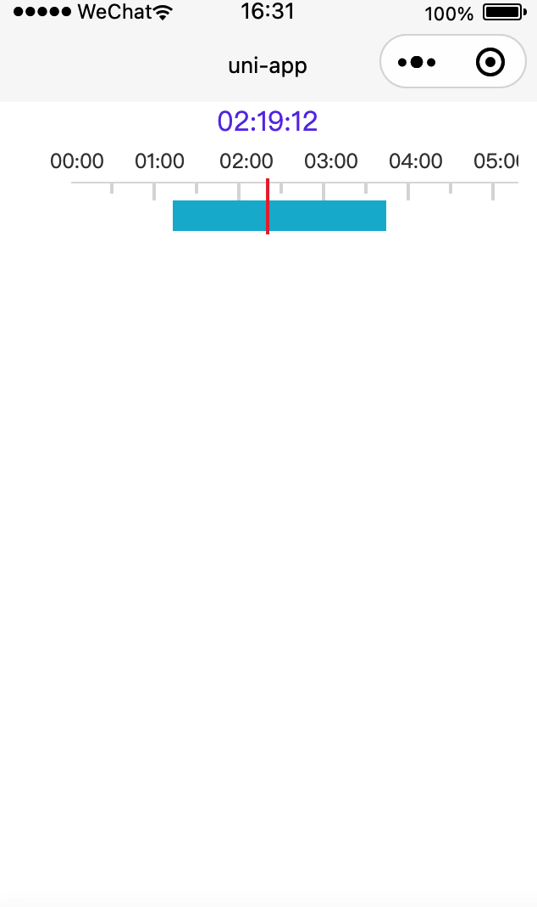

# video-time-slider

用于IVR视频回播的时间选择插件，刻度尺的实现参考了[vue语法css实现刻度尺](https://ext.dcloud.net.cn/plugin?id=4567)，为项目微信小程序制作。

其实这个可以做成前端通用组件的，因为本人项目只在微信小程序使用此插件，就先做成小程序版本了，其它平台没试过，但是估计都能用。

和 [live-player](https://uniapp.dcloud.io/component/live-player) 配合适用，播放视频挺流畅的。

## 功能

* 24小时刻度尺，30分钟分隔
* 有录像的时间段在刻度尺上标识（支持多个时间段）
* 回传刻度无录像时间段时间值、刻度有录像时间段时间值，用于接口获取播放视频
* 自动回滚最后有录像时间段

## 效果图



## 使用

### 页面引入

```
import videoTimeSlider from '@/uni_modules/video-time-slider/components/video-time-slider/video-time-slider.vue'
```

### 页面调用

```
<video-time-slider :curDate="2021-11-29"
    :activeTime="[['01:12', '03:43'],['05:22', '07:33'],['12:02', '17:39']]" 
    @value="curValue"
    @active-value="activeValue" />
```

```
export default {
    components: {
        videoTimeSlider
    },
    data() {
        return {
            curVal: '00:00'
        };
    },
    methods: {
        curValue(msg) {
            this.curVal = msg
        },
        activeValue(msg) {
            console.log(666, msg)
        }
    }
};
```

具体看例子

## 参数说明

|参数名|默认值|说明|
|:-:|:-----:| :----: |
| curDate | 2021-11-24 |日期|
| activeTime | [] | 时间段，标识可播放录像 |
| styles | {...} | 自定义卡尺样式 |

style选项

|参数名|默认值|说明|
|:-:|:-----:| :----: |
|line|#dbdbdb|刻度颜色|
|bginner|#fbfbfb|前景色颜色|
| bgoutside |#dbdbdb| 背景色颜色|
|lineSelect|#ea3639|选中线颜色|
|fontColo| #404040|刻度数字颜色|
|fontSiz|12|字体大小|

## 方法说明

|事件名称|说明|返回参数|
|:-:|:-----:| :----: |
| @value | 刻度无录像时间段时间值 |时间值字符串|
| @active-value | 刻度有录像时间段时间值| 时间值字符串 |


## 版本要求

* 微信 App iOS 最低版本要求：6.5.21 。
* 微信 App Android 最低版本要求：6.5.19。
* 小程序基础库最低版本要求：1.7.0。

